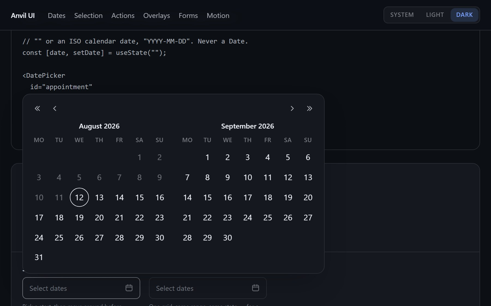

# Anvil UI

[](./LICENSE)
[](https://nextjs.org)
[](https://react.dev)
[](https://tailwindcss.com)
[](#why-the-pickers-are-the-point)

**[Live demo &rarr; ui.violettadev.com](https://ui.violettadev.com)**



Accessible React primitives for **Next.js 16 + React 19 + Tailwind v4**, styled entirely from CSS variables. MIT.

The part you probably came for: **date, range and time pickers written by hand**, with no calendar library underneath. No `react-day-picker`, no `date-fns`, no `dayjs`. Radix supplies popover positioning and focus management; the calendar grid, the keyboard model and the range logic are plain React you can read in one sitting.

```bash
pnpm install
pnpm dev        # http://localhost:3200 — every component, both themes
```

## Why the pickers are the point

Most kits hand you a date field that pulls in a calendar library, a date library
and a plugin for the timezone edge cases. Here the 42-cell month, the week offset
and the month arithmetic are about forty lines of pure functions at the top of the
file.

- **Dates cross the boundary as strings.** `"YYYY-MM-DD"`, never `Date` objects,
  never UTC. They sort chronologically as text, which is why the min/max checks
  are plain `<` and `>`.
- **Parsing stays local.** `new Date("2026-03-29T12:00:00")` — with the time and
  without the `Z`. A bare `new Date("2026-03-29")` is parsed as UTC, so `getDate()`
  returns the 28th anywhere west of Greenwich. Midday leaves twelve hours of slack
  either side of the day boundary.
- **The full keyboard model**: arrows by day, PageUp/PageDown by month, Shift for
  years, Home/End, and a single tab stop for the whole grid.
- **Localised with no dependency.** Pass a BCP-47 tag and month names come from
  `Intl.DateTimeFormat`. Every other string is a prop.

Runtime dependencies: five Radix packages (popover, select, dropdown, dialog,
tooltip) and `sonner` for toasts. That is the whole list — no date library, no
CSS-in-JS, no icon package.

## What is in here

| Component | Built on | Notes |
|---|---|---|
| `DatePicker` | Radix Popover | Hand-built month grid, full keyboard nav |
| `DateRangePicker` | Radix Popover | Two-click range with hover preview; `months={1 \| 2}`, two by default |
| `TimePicker` | — | No dependency at all |
| `Combobox` | Radix Popover | Filterable, keyboard-first, free entry allowed |
| `Select` | Radix Select | The native `<select>` replacement |
| `DropdownMenu` | Radix DropdownMenu | Menus, not selects — the distinction matters |
| `Dialog` | Radix Dialog | Focus trap, scroll lock, bottom-sheet variant |
| `ConfirmDialog` | composed | The destructive-action pattern, done once |
| `Tooltip` | Radix Tooltip | Opens on focus as well as hover |
| `Field` | — | Label / description / error wiring, children-as-function |
| `Input` | — | Text field with `leading` / `trailing` slots inside the box |
| `Textarea` | — | Optional `autoGrow`, capped by `maxRows` |
| `Checkbox` | — | Indeterminate state included |
| `RadioGroup` / `Radio` | — | Native inputs, so arrow keys and one tab stop come free |
| `Button` / `ButtonLink` | — | Four variants, three sizes, `loading`; the link is a real `<a>` |
| `Link` | — | Inline link, opt-in `external`, `subtle` variant |
| `Toaster` | sonner | Themed to match the kit |
| `Icon` | — | Inline SVG, no icon-font, no sprite |
| `Reveal` / `Stagger` | — | Scroll-reveal that does not break SSR |

Everything with a `—` in the middle column imports nothing but React and a four-line `cn()`.

## Theming

Every component reads from the tokens in `src/app/globals.css` and contains **no hard-coded colours**. Rebind the variables and everything follows:

```css
:root {
  --accent: oklch(0.55 0.16 265);
  --card: oklch(1 0 0);
  /* ... */
}
```

Light and dark are both defined, in three states: the OS preference via `prefers-color-scheme`, and an explicit `data-theme` that beats it in either direction.

## Using it in your own project

There is no npm package and that is deliberate. Copy the component files you want into your app — they have no imports outside React, Radix and `cn()`. Take `globals.css`'s `@theme` block with them, or map the token names onto your own.

One Tailwind v4 gotcha worth repeating, because it fails silently: theme variables only generate utilities inside a **known namespace**. `--color-ink` gives you `text-ink`; a bare `--ink` gives you nothing at all, with no warning. If you add tokens, keep the prefix.

## Accessibility

Keyboard paths, focus rings and ARIA wiring are part of each component rather than an afterthought. The focus ring is defined once, globally, so a component never invents its own colour. `prefers-reduced-motion` is honoured globally too.

## Licence

MIT — see [LICENSE](./LICENSE). Use it in commercial work, no attribution required.

---

Built by [Violetta Studio](https://violettadev.com).
